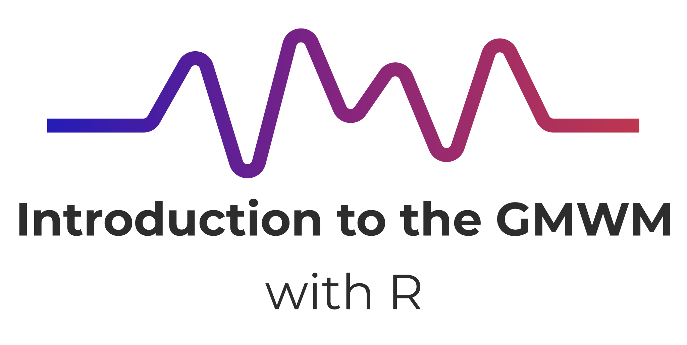

Welcome! This is the source repository for **GMWM Tutorial with R**, hosted at: <https://github.com/SMAC-Group/course_gmwm>.

The [site](https://gmwm.netlify.com/)  itself is built on an amazing framework created by <a href='https://ines.io/'>Ines Montani</a>, originally created for her [spaCy course](https://course.spacy.io).  The front-end is powered by
[Gatsby](http://gatsbyjs.org/) and [Reveal.js](https://revealjs.com) and the
back-end code execution uses [Binder](https://mybinder.org). 

If you are interested in building a course on this framework, see Ines's starter repos for making courses in [Python](https://github.com/ines/course-starter-python) and [R](https://github.com/ines/course-starter-r), and her behind-the-scenes explanation of how the framework works at [the original course repo](https://github.com/ines/spacy-course#-faq).

The course material in this course is licensed [CC-BY](https://creativecommons.org/licenses/by/4.0/), meaning you are free to use it, change it, and remix it as long as you attribute me as the original course.  The _code_ is [MIT](https://opensource.org/licenses/MIT)-licensed.
